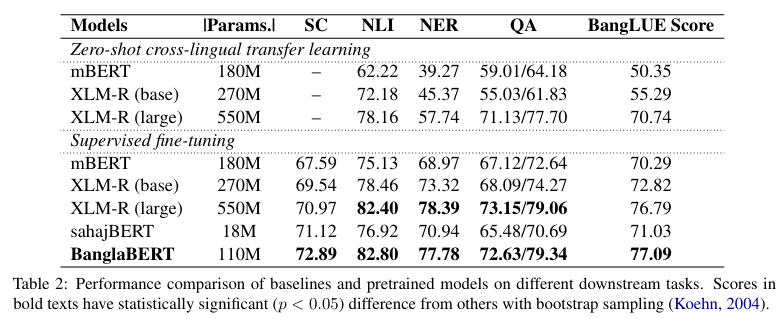

# BanglaBERT

This repository contains the official release of the model **"BanglaBERT"** and associated downstream finetuning code and datasets introduced in the paper titled [**"BanglaBERT: Combating Embedding Barrier in Multilingual Models for Low-Resource Language Understanding"**](https://arxiv.org/abs/2101.00204).

## Table of Contents

- [BanglaBERT](#banglabert)
  - [Table of Contents](#table-of-contents)
  - [Models](#models)
  - [Datasets](#datasets)
  - [Setup](#setup)
  - [Training & Evaluation](#training--evaluation)
  - [Benchmarks](#benchmarks)
  - [Acknowledgements](#acknowledgements)
  - [License](#license)
  - [Citation](#citation)

## Models

We are releasing a slightly better checkpoint than the one reported in the paper, pretrained with 27.5 GB data, more code switched and code mixed texts, and pretrained further for 2.5M steps. The pretrained model checkpoint is available **[here](https://huggingface.co/csebuetnlp/banglabert)**. To use this model for the supported downstream tasks in this repository see **[Training & Evaluation](#training--evaluation).**


***Note:*** This model was pretrained using a ***specific normalization pipeline*** available **[here](https://github.com/csebuetnlp/normalizer)**. All finetuning scripts in this repository uses this normalization by default. If you need to adapt the pretrained model for a different task make sure ***the text units are normalized using this pipeline before tokenizing*** to get best results. A basic example is available at the **[model page](https://huggingface.co/csebuetnlp/banglabert).**

## Datasets

We are also releasing the Bangla Natural Language Inference (NLI) and Bangla Question Answering (QA) datasets introduced in the paper. 
- [**NLI**](https://huggingface.co/datasets/csebuetnlp/xnli_bn)
- [**QA**](https://huggingface.co/datasets/csebuetnlp/squad_bn)

## Setup

For installing the necessary requirements, use the following snippet
```bash
$ git clone https://github.com/csebuetnlp/banglabert
$ cd banglabert/
$ conda create python==3.7.9 pytorch==1.8.1 torchvision==0.9.1 torchaudio==0.8.0 cudatoolkit=10.2 -c pytorch -p ./env
$ conda activate ./env # or source activate ./env (for older versions of anaconda)
$ bash setup.sh 
```
* Use the newly created environment for running the scripts in this repository.

## Training & Evaluation

To use the pretrained model for finetuning / inference on different downstream tasks see the following section:

* **[Sequence Classification](sequence_classification/).**
  - For single sequence classification such as
    - Document classification
    - Sentiment classification
    - Emotion classification etc.
  - For double sequence classification such as 
    - Natural Language Inference (NLI)
    - Paraphrase detection etc.
- **[Token Classification](token_classification/).**
  - For token tagging / classification tasks such as
    - Named Entity Recognition (NER)
    - Parts of Speech Tagging (PoS) etc.
- **[Question Answering](question_answering/).**
    - For tasks such as,
      - Extractive Question Answering
      - Open-domain Question Answering


## Benchmarks
 


The benchmarking datasets are as follows:
* **SC:** **[Sentiment Classification](https://aclanthology.org/2021.findings-emnlp.278)**
* **NER:** **[Named Entity Recognition](https://multiconer.github.io/competition)**
* **NLI:** **[Natural Language Inference](#datasets)**
* **QA:** **[Question Answering](#datasets)**
  
## Acknowledgements

We would like to thank [Intelligent Machines](https://bd.linkedin.com/company/intelligentmachines) and [Google TFRC Program](https://sites.research.google/trc/) for providing cloud support for pretraining the models.


## License
Contents of this repository are restricted to non-commercial research purposes only under the [Creative Commons Attribution-NonCommercial-ShareAlike 4.0 International License (CC BY-NC-SA 4.0)](https://creativecommons.org/licenses/by-nc-sa/4.0/). 

<a rel="license" href="http://creativecommons.org/licenses/by-nc-sa/4.0/"></a>

## Citation
If you use any of the datasets, models or code modules, please cite the following paper:
```
@article{bhattacharjee2021banglabert,
  author    = {Abhik Bhattacharjee and Tahmid Hasan and Kazi Samin and Md Saiful Islam and M. Sohel Rahman and Anindya Iqbal and Rifat Shahriyar},
  title     = {BanglaBERT: Combating Embedding Barrier in Multilingual Models for Low-Resource Language Understanding},
  journal   = {CoRR},
  volume    = {abs/2101.00204},
  year      = {2021},
  url       = {https://arxiv.org/abs/2101.00204},
  eprinttype = {arXiv},
  eprint    = {2101.00204}
}
```
